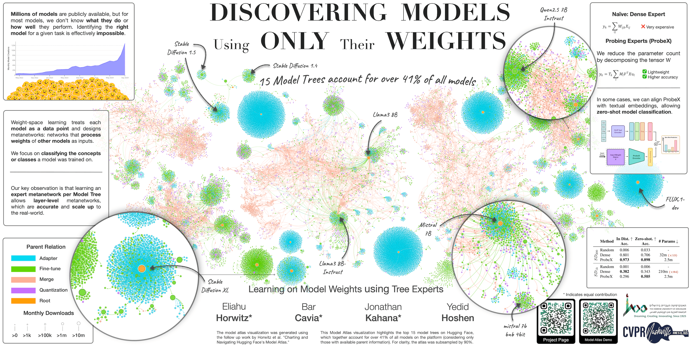

# Learning on Model Weights using Tree Experts
Official PyTorch Implementation for the "Learning on Model Weights using Tree Experts" paper (CVPR 2025).  
<p align="center">
    🌐 <a href="https://horwitz.ai/probex" target="_blank">Project</a> | 📃 <a href="https://arxiv.org/abs/2410.13569" target="_blank">Paper</a> | 🤗 <a href="https://huggingface.co/ProbeX" target="_blank">Dataset</a> <br>
</p>



___

> **Learning on Model Weights using Tree Experts**<br>
> Eliahu Horwitz*, Bar Cavia*, Jonathan Kahana*, Yedid Hoshen<br>
> <a href="https://arxiv.org/abs/2410.13569" target="_blank">https://arxiv.org/abs/2410.13569 </a> <br>
>
>**Abstract:** The number of publicly available models is rapidly increasing, yet most remain undocumented. 
> Users looking for suitable models for their tasks must first determine what each model does. 
> Training machine learning models to infer missing documentation directly from model weights is challenging, 
> as these weights often contain significant variation unrelated to model functionality (denoted nuisance). 
> Here, we identify a key property of real-world models: most public models belong to a small set of *Model Trees*, 
> where all models within a tree are fine-tuned from a common ancestor (e.g., a foundation model). 
> Importantly, we find that within each tree there is less nuisance variation between models. 
> Concretely, while learning across Model Trees requires complex architectures, even a linear classifier trained 
> on a single model layer often works within trees. While effective, these linear classifiers are computationally 
> expensive, especially when dealing with larger models that have many parameters. To address this, we introduce
> *Probing Experts* (ProbeX), a theoretically motivated and lightweight method. Notably, ProbeX is the first 
> probing method specifically designed to learn from the weights of a single hidden model layer.
> We demonstrate the effectiveness of ProbeX by predicting the categories in a model's training dataset based only
> on its weights. Excitingly, ProbeX can map the weights of Stable Diffusion into a weight-language embedding
> space, enabling model search via text, i.e., zero-shot model classification.


___


## Project Structure
This project consists of:
- `download_dataset.py` - script for downloading the Model-J dataset from Hugging Face.
- `train_discriminative_probex.py` - main file for training ProbeX on the discriminative splits of the Model-J dataset.


## Installation 
1.  Clone the repo:
```bash
git clone https://github.com/eliahuhorwitz/ProbeX.git
cd ProbeX
```
2. Create a new environment and install the libraries:
```bash
python3 -m venv ProbeX_venv
source ProbeX_venv/bin/activate
pip install -r requirements.txt
```

## Download the Model-J dataset
The Model-J dataset contains different subsets of descriminative and generative models, to download a subset of models run:
```bash
python download_dataset.py --dataset_subset=SUBSET_NAME
```
Where `SUBSET_NAME` can be one of the following:
"SupViT", "DINO", "MAE", "ResNet"

The models will be downloaded from Hugging Face and saved in the `.cache/huggingface/assets/ProbeX/ModelJ/default/models/` directory. Each of the subsets is about 350GB, so we recommend starting with a single subset.


## Running ProbeX
Below are examples for running ProbeX on the Model-J dataset subsets.   

### Discriminative Splits
ProbeX can be trained on the discriminative splits of the Model-J dataset to predict the categories in a model's training dataset. The training is done using the `train_discriminative_probex.py` script.
ProbeX trains an individual model per layer, to choose the best layer we use the validation set. 
The training script trains layers sequentially, the script supports specifying the start layer and the number of layers to train, allowing this to be distributed across multiple GPUs.

Below is an example of training a single layer, see `sbatch_run_probex.sh` for an example of distributing the training of multiple layers across multiple GPUs.

#### ViT
```bash
python train_discriminative_probex.py --input_path="~/.cache/huggingface/assets/ProbeX/ModelJ/default/models/SupViT/" 
--output_path="ProbeX_outputs/SupViT" --is_resnet="False" --start_layer=59 --n_layers=1 
```

> [!TIP] 
> Different subsets may have different layers which work best. Based on our findings, these are the best layers for classifying the training categories:
> - SupViT: 59
> - DINO: 59
> - MAE: 64
> - ResNet: 59


> [!TIP] 
> Different tasks will likely have different best layers. If trying to classify different attributes (e.g., augmentation use, specific biases, optimization parameters) you should experiment with **all** layers and choose the best ones. 
 
### Generative Splits
Coming soon...
#### Downstream tasks
Coming soon...

___

## Citation
If you find this useful for your research, please use the following.

```
@InProceedings{Horwitz_2025_CVPR,
    author    = {Horwitz, Eliahu and Cavia, Bar and Kahana, Jonathan and Hoshen, Yedid},
    title     = {Learning on Model Weights using Tree Experts},
    booktitle = {Proceedings of the Computer Vision and Pattern Recognition Conference (CVPR)},
    month     = {June},
    year      = {2025},
    pages     = {20468-20478}
}
```


## Acknowledgments
- The project makes extensive use of the different Hugging Face libraries (e.g. [Diffusers](https://huggingface.co/docs/diffusers/en/index), [PEFT](https://huggingface.co/docs/peft/en/index), [Transformers](https://huggingface.co/docs/transformers/en/index)).
- The [Model-J dataset](https://huggingface.co/ProbeX) is hosted on Hugging Face.

